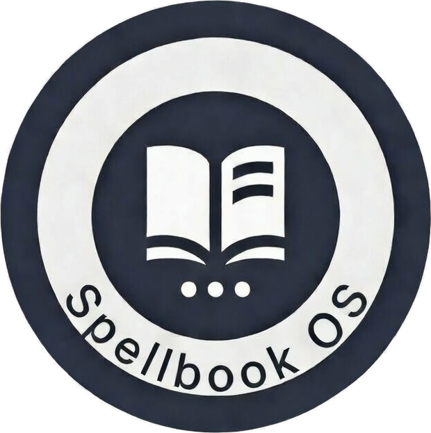

<div align="center">

[](#)
[](https://www.gnu.org/licenses/gpl-3.0)
[](https://www.zsh.org/)
[](https://ohmyz.sh/)
[](https://github.com/AndreBFarias/spellbook-OS/stargazers)



<h1>Spellbook OS</h1>

</div>

---

Configuração zsh modular e portável. 22 módulos de funções, 9 scripts Python, sistema de quota de IA, menu FZF interativo para projetos dbt/BigQuery, controle automático de identidade git e integração com Oh My Zsh. Instalável em qualquer máquina Linux com um único comando.

---

### Módulos

| Módulo | Descrição |
|--------|-----------|
| `functions/mec.zsh` | Menu FZF completo para projetos dbt/BigQuery (29 operações) |
| `functions/git-contexto.zsh` | Identidade git automática por diretório |
| `functions/conjurar.zsh` | Menu FZF global de ferramentas |
| `functions/diagnostico.zsh` | Diagnóstico de ambiente e dependências |
| `functions/sync.zsh` | Sincronização de repositórios com backup |
| `functions/controle-de-bordo.zsh` | Gestão de projetos e tarefas |
| `functions/projeto.zsh` | Criação e gestão de projetos |
| `functions/pulso.zsh` | Monitor de sistema em tempo real |
| `functions/vault-automation.zsh` | Automação de cofre de notas |
| `functions/limpeza.zsh` | Limpeza de ambiente e temporários |
| `functions/_helpers.zsh` | Paleta Dracula + utilitários base |
| `claude/` | Sistema de quota para Claude AI |
| `kimi/` | Integração Kimi AI |
| `scripts/` | Scripts Python auxiliares (dbt, migração, análise) |

---

### Instalação

#### Bootstrap completo (nova máquina)

```bash
git clone https://github.com/AndreBFarias/spellbook-OS ~/Desenvolvimento/spellbook-OS
bash ~/Desenvolvimento/spellbook-OS/install.sh
```

O `install.sh` instala as dependências, Oh My Zsh com plugins, sincroniza os arquivos para `~/.config/zsh/` e guia a configuração via TUI interativa.

#### Atualizar (já instalado)

```bash
cd ~/Desenvolvimento/spellbook-OS && git pull && ./install.sh --update
```

O modo `--update` preserva `config.local.zsh` e `.zsh_secrets` existentes.

---

### Requisitos

**Sistema (instalados automaticamente pelo install.sh):**

```
zsh  git  fzf  jq  pv  rsync  tree  python3  pip3  whiptail
```

**Python (via requirements.txt):**

```
pandas >= 2.0
openpyxl >= 3.1
```

---

### Configuração pós-instalação

Editar os arquivos gerados pelo installer:

| Arquivo | Conteúdo |
|---------|----------|
| `~/.config/zsh/config.local.zsh` | Caminhos locais, identidades git, `BQ_KEYFILE_PATH` |
| `~/.config/zsh/.zsh_secrets` | `GITHUB_TOKEN`, `GEMINI_API_KEY`, `ANTHROPIC_API_KEY` |
| `~/.config/zsh/profiles.yml` | Configuração dbt BigQuery |

Os templates estão em `*.template` para referência.

---

### Estrutura

```
spellbook-OS/
├── install.sh                  # Instalador com TUI whiptail
├── requirements.txt            # Dependências Python
├── .zshrc                      # Entry point do zsh
├── env.zsh                     # Ambiente + Oh My Zsh
├── aliases.zsh                 # Aliases gerais
├── functions.zsh               # Loader de módulos
├── config.local.zsh.template   # Template: vars por máquina
├── .zsh_secrets.template       # Template: tokens e API keys
├── profiles.yml.template       # Template: dbt BigQuery
├── assets/
│   └── spellbook_os.png
├── functions/                  # 22 módulos zsh
│   ├── _helpers.zsh
│   ├── mec.zsh
│   ├── git-contexto.zsh
│   └── ...
├── scripts/                    # Scripts Python
│   ├── mec-dbt-results.py
│   ├── mec-migrar-censo.py
│   └── universal-sanitizer.py
└── claude/                     # Sistema de quota
    ├── aliases_claude.zsh
    ├── claude_guard.sh
    └── claude_quota_manager.sh
```

---

### Licença

GPLv3 — Veja [LICENSE](LICENSE) para detalhes.
